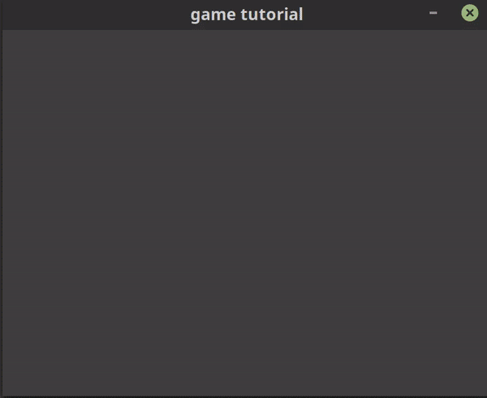

# game-tutorial

Each commit in this repo is a step in a game development tutorial I created for
some friends. The game is built in the Rust programming language using the Rust
SDL2 crate and the specs ECS.

We start making the game with just the SDL2 crate and then convert it to use the
specs ECS as our code starts to grow. Once the ECS is added, we're able to
quickly add more functionality like enemies, etc.

